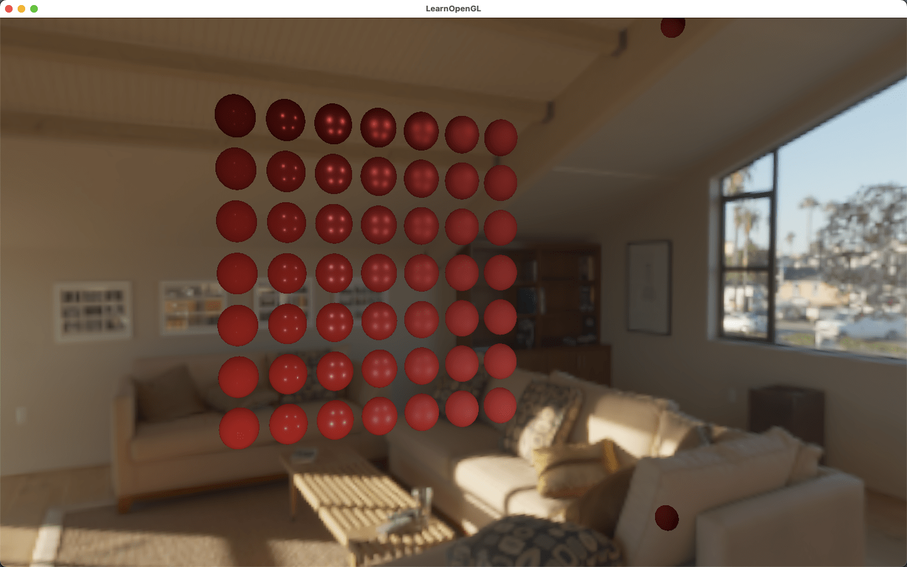
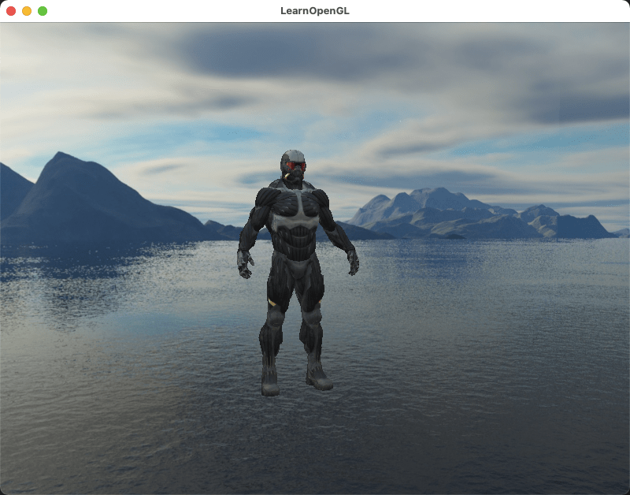

<p align="center">
    
</p>
<p align="center">
    
</p>

Realistic PBR is realized by using OpenGL and GLSL. Different spheres have different normal distribution and roughness, so as to calculate different NDF and mask functions, and then calculate different fresnel equation reflectivity according to different metallic, so as to calculate Different BRDFs get different lighting effects.
This also includes the effect of using cubemap to get skybox.

#### environment config

https://maxyoung.fun/blog/OpenGL%E7%8E%AF%E5%A2%83%E9%85%8D%E7%BD%AE.html

#### usage

 ```shell
 $ cd build
 $ make
 $ ./HelloGL
 ```